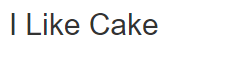
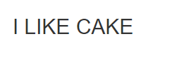
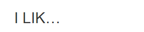
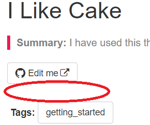
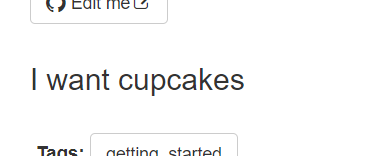
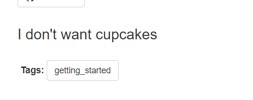
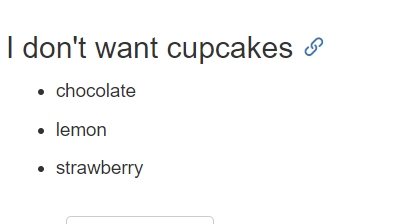

# Jekyll Casts

- [x] Introduction to Jkeyll Collections
- [x] Front matter
- [x] [Layouts](youtube.tutorial.log#Layouts)
- [x] Jekyll Includes
- [x] Introduction to Liquid(youtube.tutorial.log#Liquid)
- [x] Control Flow Statements in Liquid#Control-Flow-Statements-in-Liquid)

## Layouts

## Liquid

### 使用tag

```
---
title: "mycake"
---

{{ page.title }}
```

效果如下：  


### 使用filter

filter前面用“***|***“。

#### upcase

```

## {{ page.title | upcase } }
```

效果如下：  


#### 叠加参数

```
## {{ page.title | upcase | truncate:8 } }
```
限制显示8个字符（好像包含...)： 
>  truncate shortens a string down to the number of characters passed as a parameter. If the number of characters specified is less than the length of the string, an ellipsis (…) is appended to the string and is included in the character count.  

效果如下：  


### Control Flow

#### If Statement

```
---
...
heading: I Like Case
show_heading: false
...
---

  
   <h2>{{ page.title | upcase | truncate:8 }}</h2>
  
```

**注意**：
- 这里我用##怎么不行啊，后来变成`<h2>`才行。然后在tom的模板中，不知道是不是和toc冲突了。把toc改成了false，才正常的用到了这里的control flow。

因为front matter中的show_heading的值是false，所以不显示，如下：  



如果在front matter中，把`show_heading`中的值改成true，就能正常显示了。

##### 加上elsif试试看：
```
---
show_heading: false
toc: false
---
  
   <h2> {{ page.title | upcase | truncate:8 }}</h2>
  
   <h2> I want cupcakes</h2>
  
```

效果如下：



##### 继续加上else试试看：
```
---
show_heading: false
toc: false
---
  
   <h2> {{ page.title | upcase | truncate:8 }}</h2>
  
   <h2> I want cupcakes</h2>
  
   <h2>I don't want cupcakes</h2>
  
```

效果如下：



## Iteration

```

```

先在page frontmater里加上一个mapping，mapping中会有一个array。你需要指定一个变量，这个变量会去访问这个array中的所有值，并将它们全部显示出来：
```
---
...
fruit:
  - chocolate
  - lemon
  - strawberry
---
<ul>
  
    <li>
    {{ item }}
    </li>
  
</ul>
```

效果如下：



# Control Flow Statement in Liquid



